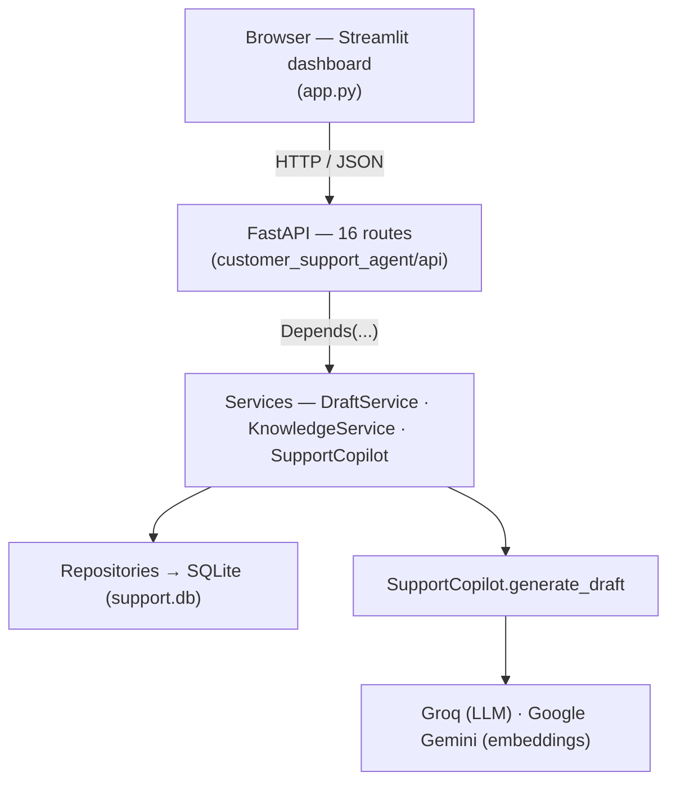
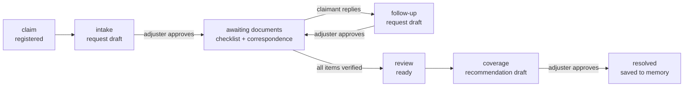

# Insurance Claims Copilot

An AI copilot that drafts the **first response** to an auto-insurance claim — for a
licensed adjuster to review, edit, and approve. It removes the blank-page work,
not the judgment.

Built as a study in **evaluation-driven development**: measure whether the AI's
output is actually good, then iterate against the numbers. The full before/after
is in [`docs/ITERATION_LOG.md`](docs/ITERATION_LOG.md).

> This is a portfolio build with a small synthetic knowledge base, not a deployed
> system — see [Known limitations](#known-limitations).

---

## The problem

When someone files an auto claim, an adjuster has to write back with four things:
which coverage applies, exactly which documents the claimant must send, how long
each step takes, and whether the claim needs urgent handling. The rules for all of
this already live in the insurer's policy and procedure manuals — but doing it
well, on every claim, runs into several problems at once:

- **It's slow and adjuster-bound.** Claim volume spikes with weather events;
  first-response times slip past SLA.
- **It's inconsistent between people.** Two adjusters give two different answers
  to the same claim; a new hire takes months to get consistent.
- **Customer history is trapped with whoever handled it last.** If a repeat
  claimant — or another employee of the same insured company — files again, the
  adjuster picking it up usually has no idea how the previous claim was resolved.
  That context sits in a closed file nobody re-reads. The claimant re-explains
  themselves; the new adjuster re-derives a decision that was already made; the
  same account gets handled two different ways.
- **Urgent and suspicious claims get missed in the queue.** An injury, a
  hit-and-run, a policy that started days before the loss — these need to be
  caught on *every* claim, not just the ones a busy adjuster happens to scrutinise.
- **A wrong first reply is expensive.** Wrong coverage or a missed document means
  re-work and complaints. A premature "denied" carries legal weight.

The catch: you can't just automate it away — the coverage *decision*, especially a
denial, is a regulated call a licensed human must own.

## The solution

A copilot that produces the **drafts** and carries the claim through the
document-collection loop — never making the decision. It:

- **Classifies the likely coverage** from an explicit rule set drawn from the
  policy documents.
- **Builds the documents checklist** for *that* claim type automatically, and
  drafts the first reply requesting exactly those items — one precise request
  instead of a generic list that triggers back-and-forth.
- **Drafts the follow-up chases** as the claimant responds — covering only what's
  still outstanding — and, once the adjuster has verified every item, **drafts
  the preliminary coverage recommendation**.
- **Quotes the real service-level timeline** — never an invented number.
- **Flags urgent and suspicious claims** — injury, hit-and-run, large loss,
  commercial vehicle, or fraud indicators (recent policy, delayed report) — in
  neutral language, on every claim.
- **Surfaces the customer's history automatically.** Every resolved claim is
  saved as a short note, filed under both the individual *and* their company. A
  new claim from either pulls the relevant past resolutions into the draft — so
  it's consistent with how the account was handled before, no matter which
  adjuster is on it now.
- **Records what it used.** Every draft carries a trace of the policy sections,
  documents, checks, and prior resolutions it drew on.

The adjuster reviews, edits, and approves each draft; ticks the checklist as
documents arrive; and makes the coverage call. The blank-page work is gone.
What this is designed to enable:

| | |
|---|---|
| **Speed** | first response in seconds — helps hold SLA during volume spikes |
| **Consistency** | same claim → same answer, across adjusters *and* across a customer's history |
| **Faster ramp** | a new adjuster produces a competent, on-policy first draft on day one — reviewing, not memorising the manual |
| **Screening on every claim** | urgent and fraud signals caught automatically, not only when someone looks |
| **Senior-adjuster capacity** | routine first-responses stop eating expert time; they focus on the disputed and complex cases |

### What it deliberately does *not* do

- Make or send the final coverage decision
- Touch payments
- Talk to the claimant directly — it is an adjuster's tool

---

## Why this project is interesting (engineering)

| | |
|---|---|
| **Evaluation harness, not vibes** | A labelled test set, rule-based checks + an LLM-as-judge (a *larger* model than the generator), and a documented series of iterations with measured deltas. Groundedness moved **1.11 → 1.71 / 2** across the fixes. |
| **RAG done deliberately** | Curated single-domain corpus; a document needed on *every* draft is injected as fixed context rather than left to similarity search; retrieval quality is measured, not assumed. |
| **Agent → direct calls** | Started with an LLM agent choosing tools. Measured that the tools apply to *every* claim and the model never really chose — replaced the agent with a single generation call. **~4× fewer tokens, ~5× faster, same grounding.** |
| **Deterministic guardrail** | The eval proved a prompt rule can't stop the model guessing on vague input. A hard pre-check now blocks under-described claims (and prompt-injection attempts) before they reach the model. |
| **Honest about its gaps** | [`docs/DESIGN_GAPS.md`](docs/DESIGN_GAPS.md) — a catalogue of architectural gaps across three tiers (auth, persistence, concurrency, rate limits), each with a fix and a rough cost, most deliberately left as "next steps". |

---

## Quickstart

Requires Docker and a free [Groq API key](https://console.groq.com). A
[Gemini key](https://aistudio.google.com/apikey) is optional — it improves
embedding quality.

```bash
cp .env.example .env          # then paste your GROQ_API_KEY into .env
docker compose up
```

- Dashboard → **http://localhost:8501**
- API docs → **http://localhost:8000/docs**

Without Docker:

```bash
python -m venv .venv
.venv/Scripts/pip install -r requirements.txt      # .venv/bin/pip on macOS/Linux
python main.py                                     # API  :8000
python -m streamlit run app.py                     # dashboard  :8501  (second terminal)
```

---

## How it works



- **Backend** — FastAPI, layered (routers → dependency injection → services →
  repositories). `SupportCopilot` orchestrates the draft pipeline; `WorkflowService`
  owns the claim lifecycle.
- **Frontend** — Streamlit. A claim-intake form and a stage-aware workbench: the
  editable draft, the documents checklist, the correspondence log, and a "Context
  used" panel showing every document and signal the draft drew on.
- **Storage** — SQLite (claims, drafts, checklist, correspondence — on disk),
  Chroma (knowledge-base vectors, on disk), an in-memory store for per-customer
  resolution memory *(RAM-only — a known gap)*.
- **Models** — Groq `openai/gpt-oss-20b` (drafts), `openai/gpt-oss-120b` (eval
  judge), Google `gemini-embedding-001` (embeddings).

### The claim lifecycle — the AI drafts at three points



Each draft is **one LLM call** with a deterministic template fallback. The intake
draft runs a hard pre-check (impact detail present? — a claim too thin, or a bare
injection attempt, never reaches the model) and then folds memory, retrieval, and
three plain-Python signal checks into a single prompt.

Full walkthrough — the layer cake, the request flow, the lifecycle state machine:
[`docs/architecture.md`](docs/architecture.md).

---

## Evaluation

```bash
python evals/run_eval.py          # runs the claim set, scores each draft
```

Writes a per-claim table and aggregate scores to `evals/results/`. What's scored:

- **Retrieval** — did the search return the documents this claim needs?
- **Rule checks** — safety language present, no banned phrases, within length,
  right coverage named.
- **Judge** (`gpt-oss-120b`) — *groundedness* (states only what it can back up),
  *coverage correctness*, *safety* (never a binding decision without an adjuster).

Headline movement over the iteration series:

| | baseline | after fixes |
|---|---|---|
| only states backable facts (of 2) | 1.11 | **1.71** |
| picks the right coverage (of 2) | 1.89 | 1.6\* |
| stays safe | 9/9 | 7/7 + 2 gated |
| claims the AI refuses to touch | 0 | **2** (too vague, injection) |

\* the dip is mostly over-strict answer labels; see the log. Test manual:
[`docs/HOW_TO_TEST.md`](docs/HOW_TO_TEST.md).

These numbers cover the **intake** draft. The follow-up and coverage-recommendation
drafts added in Phase 2 are not in the harness yet — see the note at the end of
[`docs/ITERATION_LOG.md`](docs/ITERATION_LOG.md).

---

## Project layout

```
customer_support_agent/     backend package
  api/routers/              FastAPI routes (tickets, drafts, workflow, ...)
  api/dependencies.py       dependency injection / wiring
  services/                 SupportCopilot, DraftService, WorkflowService,
                            intake_check, requirements_catalog
  integrations/rag/         Chroma knowledge base
  integrations/memory/      langmem customer memory
  integrations/tools/       the three signal checks
  repositories/sqlite/      data access (raw SQL)
  core/settings.py          configuration
app.py                      Streamlit dashboard
main.py                     API entrypoint
evals/                      test set, metrics, judge, runner
tests/                      unit tests (pytest)
docs/                       ITERATION_LOG, DESIGN_GAPS, HOW_TO_TEST, architecture
knowledge_base/             the 5 policy / procedure documents
```

---

## Configuration

Set in `.env` (see `.env.example`):

| variable | required | notes |
|---|---|---|
| `GROQ_API_KEY` | **yes** | the LLM that writes drafts |
| `GOOGLE_API_KEY` | no | Gemini embeddings; without it, a weaker local model is used |
| `GROQ_MODEL` | no | default `openai/gpt-oss-20b` |

---

## Known limitations

This is a portfolio project, not production. The main gaps (full list in
[`docs/DESIGN_GAPS.md`](docs/DESIGN_GAPS.md)):

- **No authentication** — anyone who can reach the API can act on claims.
- **Customer memory is RAM-only** — resolution history is lost on restart.
- **SQLite** — fine for a demo; would not hold up under concurrent adjusters.
- **Rate limits** — on Groq's free tier, one draft can exceed the per-minute
  token budget; retry converts this to latency, not a fix. A paid tier or a
  request queue is the real answer.
- The knowledge base is 5 synthetic documents, not a real policy system.

---

## Tech

Python 3.13 · FastAPI · Streamlit · LangChain · Chroma · SQLite · Groq · Google
Gemini · Docker · pytest
