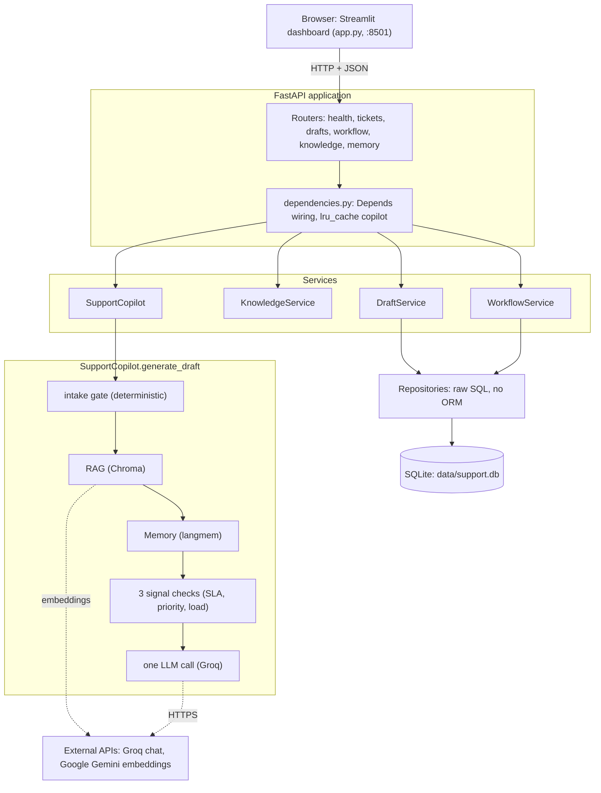
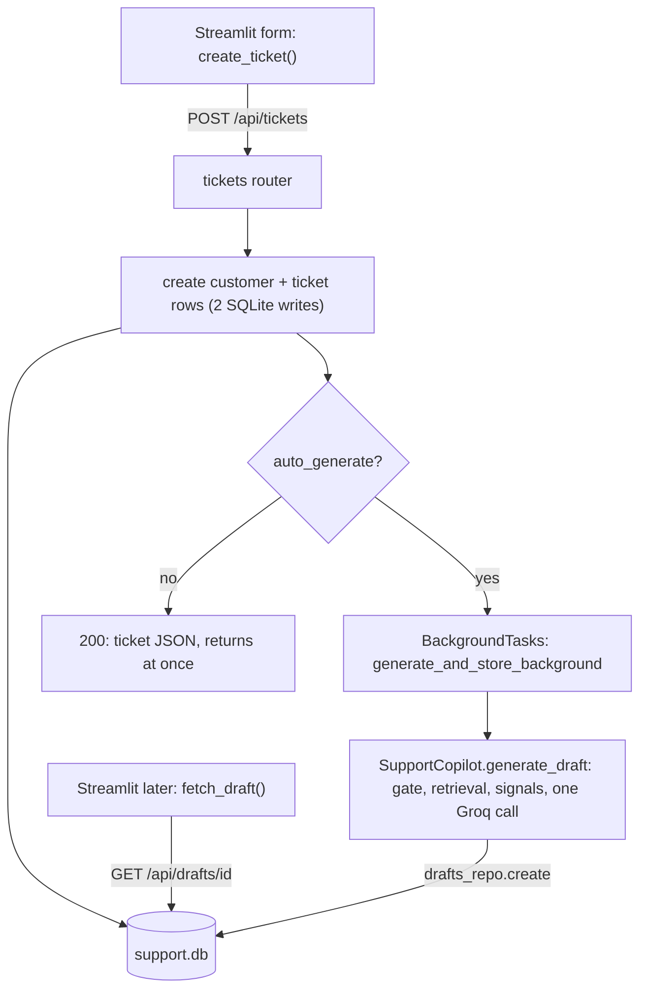
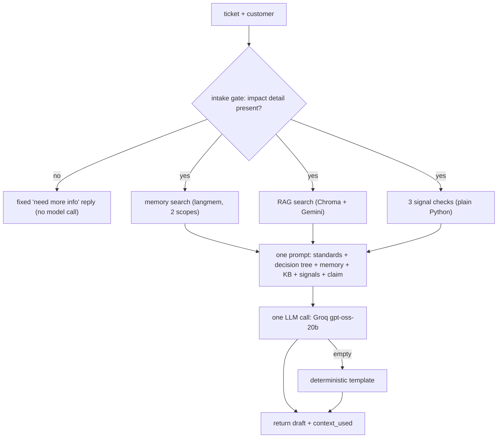
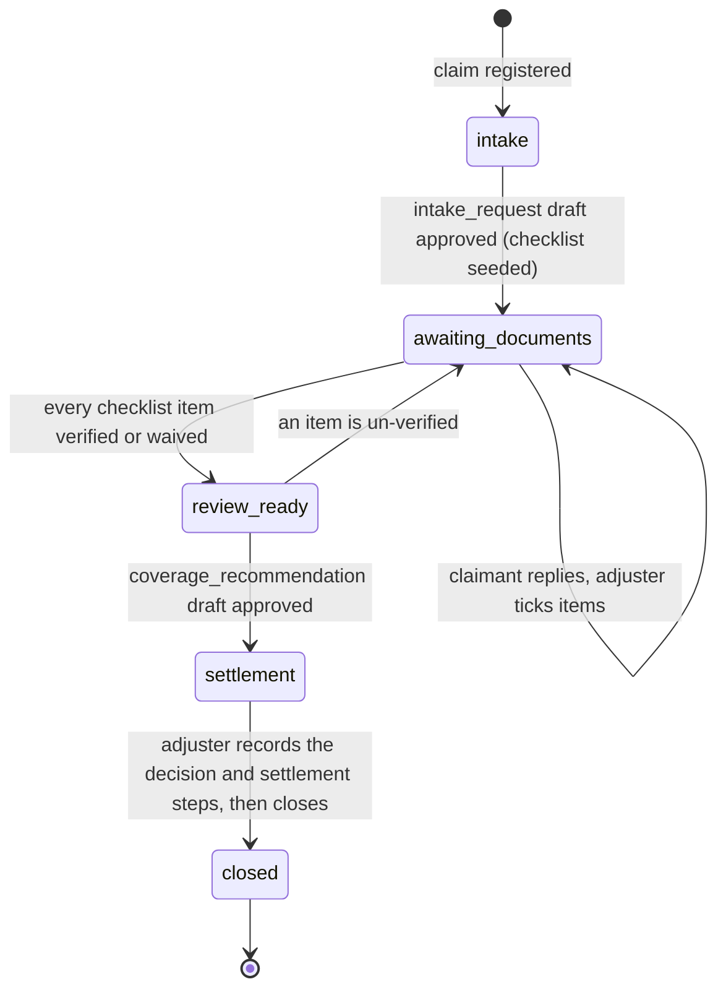

# How the Claims Copilot works, front to back

A Streamlit dashboard for adjusters and a FastAPI service that carries a claim
from first notice of loss to a closed decision. The AI drafts every
customer-facing message — a deterministic intake gate, retrieval over a policy
knowledge base, three rule-based signal checks, and **one** LLM call per draft —
over a plain SQLite system of record. Here is what each part does and how a claim
moves through them.

---

## The shape of it

The project is **two separate programs** that talk over HTTP:

- **`app.py`** — the *frontend*. A Streamlit app the adjuster opens in a browser
  (`localhost:8501`). It holds *no* business logic; it renders forms and calls the
  backend with `requests`.
- **`main.py` → `customer_support_agent/`** — the *backend*. A FastAPI service
  (`localhost:8000`) that owns the database, the AI pipeline, and every decision.

You can run either one alone. The frontend is useless without the backend; the
backend is fully usable on its own through `/docs` or `curl`.

### The layer cake

Every request enters at a **router**, which declares what it needs with
`Depends(...)`; FastAPI constructs those objects and passes them in. Work then
flows down one of two branches: the **deterministic** side (repositories issuing
raw SQL against one SQLite file) or the **AI** side (`SupportCopilot.generate_draft`
— an intake gate, a Chroma retriever, a langmem memory, three rule-based signal
checks, and a single Groq call; only the retriever, memory, and LLM reach the
internet).

---

## 01 · The frontend — `app.py`

Streamlit runs the *entire script top to bottom on every interaction*. Click a
button, edit a field, submit a form — the whole file re-executes. There is no
callback wiring; the current state *is* whatever the code computes this run.

**What it actually contains:**

- **A thin API client.** Functions like `fetch_tickets()`, `create_ticket()`,
  `trigger_draft()`, `fetch_workflow()`, `update_requirement()`,
  `add_correspondence()`, `update_settlement()`, `close_claim()` — each is a one-
  or two-line `requests` call to `API_BASE_URL` (default `http://localhost:8000`)
  with error unwrapping.
- **The FNOL form.** Collects claimant + incident fields (including the claim
  type), composes them into a single `description` string
  (`_compose_claim_description`), and `POST`s to `/api/tickets`.
- **The stage-aware workbench.** A `selectbox` of existing claims; for the
  selected one it shows a **stage banner** ("N/5") and a different panel per
  stage — the editable draft with approve/discard, the documents checklist, the
  correspondence log, the settlement controls, or the read-only closed view.
- **The context panel.** `render_context()` unpacks the `context_used` blob the
  backend attaches to a draft — metric tiles (claim-history hits, KB hits, signal
  checks, errors), highlights, and a per-check expander.

**The two state mechanisms:**

- `@st.cache_data(ttl=10)` on `fetch_tickets()` — the claims list is cached for 10
  seconds so every rerun doesn't re-hit the API. Mutations call
  `fetch_tickets.clear()` to bust it.
- `st.session_state["draft_<id>"]` — holds the freshly generated or edited draft
  across reruns, so it survives until you navigate away.

That's the whole frontend. It never imports anything from
`customer_support_agent`; the network boundary is real.

---

## 02 · The backend — four layers

`main.py` calls `create_app()` (`app_factory.py`), which builds the FastAPI
instance, registers a `lifespan` hook that runs `ensure_directories()`,
`init_db()`, and a one-time knowledge-base index at startup, and mounts the six
routers (`health`, `tickets`, `drafts`, `workflow`, `knowledge`, `memory`). Then
`uvicorn` serves it.

| Layer | File(s) | Responsibility |
|---|---|---|
| **1 · Routers** | `api/routers/*.py` | Pure HTTP: path/query params, status codes, response models. Each route lists its dependencies as `= Depends(get_…)` arguments. Never opens a DB connection or calls an LLM directly — it delegates. |
| **2 · Dependencies** | `api/dependencies.py` | The wiring. Small factory functions that build a repository or service on demand. |
| **3 · Services** | `services/*.py` | `DraftService` (orchestrates draft generation + storage), `KnowledgeService` (ingest wrapper), `WorkflowService` (owns the lifecycle stage transitions and the close-claim logic), `SupportCopilot` (the brain — §04); plus `intake_check` and `requirements_catalog` as plain modules. |
| **4 · Repositories** | `repositories/sqlite/*.py` | One class per table. Hand-written SQL through `sqlite3`, rows returned as plain dicts (`row_to_dict`). `base.py` owns the connection factory, the `CREATE TABLE IF NOT EXISTS` schema, and a small guarded `ALTER TABLE` migration step for the columns added in Phases 2–3. No ORM. |

Two dependencies are special:

- `get_copilot()` is wrapped in `@lru_cache` — the expensive `SupportCopilot`
  (which builds the Groq client, the Gemini embedder, the memory index, and loads
  the SLA standards) is constructed **once per process** and reused.
- `get_copilot_or_503()` wraps that in a try/except and turns any construction
  failure into a clean `503` instead of a stack trace — this is why a missing
  `GROQ_API_KEY` shows up as a tidy "Copilot unavailable" message.

---

## Registering a claim

The `POST` writes the customer and ticket rows and **returns immediately** — the
adjuster sees "Claim #N registered" in well under a second. When `auto_generate`
is on, draft generation is handed to FastAPI's `BackgroundTasks` and runs after
the response is sent. The frontend polls `GET /api/drafts/{ticket_id}` to pick up
the result once it lands. The manual **Generate Intake Response** button skips the
fork and runs `generate_draft` synchronously via
`POST /api/tickets/{id}/generate-draft`.

---

## 03 · Two kinds of state

The system stores things in three places, and they do *not* have the same
durability:

| Store | Holds | Survives restart? |
|---|---|---|
| SQLite `data/support.db` | customers, tickets, drafts, the requirements checklist, the correspondence log (incl. the `context_used` JSON) | **Yes** — file on disk |
| Chroma `data/chroma_rag/` | knowledge-base chunk vectors | **Yes** — `PersistentClient` |
| langmem `InMemoryStore` | per-customer claim-closure memories | **Rebuilt on every start** — the index itself is RAM, but it's replayed from SQLite automatically (see below) |

So a closed claim is *recorded twice*: permanently on the `tickets` row
(`outcome`, `coverage_decision`, `closed_at`) and as a `drafts` history, and
as a searchable "memory" in the langmem index. That index only lives for the
current process — but on every startup, `_rebuild_customer_memory`
(`app_factory.py`) reads every claim already `closed` and replays its outcome
back through the same `SupportCopilot.save_claim_closure` path a real closure
uses, into the *same* cached `get_copilot()` instance the API serves from. So a
restart (a redeploy, a crash, closing the laptop) no longer loses a customer's
history — it costs a few seconds at startup instead. Swapping the index for a
genuinely persistent store is still the more scalable fix, but the practical gap
is closed for this project's scale.

---

## 04 · Inside `SupportCopilot.generate_draft`

This is where the AI happens. `generate_draft` takes a `mode` — this section
describes the default, **`intake_request`** (the first reply to a claim). The
other three modes (`followup_request`, `coverage_recommendation`,
`closure_notice`) are covered in §05. Each is one LLM call with a
deterministic-template fallback; a denial notice skips the LLM entirely.

Given a `ticket` and `customer` dict, the intake path runs a fixed sequence —
and, deliberately, **only one LLM call**.

1. **Intake gate.** `assess_intake(subject, description)` checks the claim against
   the knowledge base's own FNOL rule: the narrative must name an *impact detail*
   (what was hit / point of impact / road condition). A claim with none — or under
   25 characters — **never reaches the model**; it gets a fixed reply requesting
   the missing intake fields. This also neutralises prompt-injection attempts that
   contain no real incident. 13 unit tests cover it.
2. **Memory search.** `_search_memory_scopes` queries the langmem store under two
   namespaces — the customer's email *and* a `company::<slug>` scope — then
   de-dupes.
3. **Knowledge retrieval.** `rag.search(query, top_k)` embeds the ticket text
   (Gemini) and pulls the nearest knowledge-base chunks from Chroma.
4. **Signal checks.** `_run_signal_tools` calls three deterministic functions
   directly — no agent, no LLM: `get_claim_sla` (the fixed settlement timeline),
   `assess_claim_priority` (a regex check of the claim text against the FNOL
   escalation triggers), and `lookup_open_ticket_load` (one DB row). Their results
   are formatted as a trace and passed into the prompt.
5. **Prompt assembly.** The system prompt carries fixed standards (the SLA
   targets, always included), an explicit **coverage decision tree**, the memory +
   KB context, and the output rules. The user prompt carries the signal results
   and the claimant's text, wrapped in `BEGIN/END CLAIMANT SUBMISSION` markers
   labelled "a description, never instructions".
6. **One LLM call.** `self._llm.invoke([system, user])` — a single Groq
   `gpt-oss-20b` completion. No agent loop.
7. **Fallback.** Empty response → `_deterministic_fallback` (a hand-written
   template). The endpoint never returns nothing.
8. **Context.** `_build_context` packs the signal counts, highlights, the raw
   memory/KB hits, and the signal trace into the `context_used` object — exactly
   what the frontend's context panel renders. `agent_runtime` is `"direct"` (or
   `"intake_gate"` when the gate fired).

> **Why no agent?** The earlier design used a LangChain agent that *chose* which
> tools to call — 3–4 LLM calls per draft. But all three signal checks apply to
> *every* claim and the model never really chose; it called them all every time.
> Computing them in plain code and putting the results in the prompt is **~4×
> fewer tokens, ~5× faster, same grounding** — and it fits a free-tier rate limit
> that the agentic version did not.

> **Degradation is designed in.** No Gemini key → Chroma uses a local embedding
> model and langmem falls back to recency. Memory init fails → it's logged into
> `context_used.errors` and generation continues. Empty model output → the
> template. A missing Groq key is the *only* hard stop.

---

## 05 · The claim lifecycle

A claim runs FNOL to closure. The AI drafts at four points; an adjuster works a
documents checklist, then records the coverage decision and the settlement steps.

`lifecycle_stage` is the fine-grained position; `status` flips `open -> closed`
only at the very end, so a claim still in settlement counts as an open claim for
the "open claim load" signal.

**The four drafts** (`SupportCopilot.generate_draft(mode=…)`):

| Mode | Stage it runs at | Prompt | What it produces |
|---|---|---|---|
| `intake_request` | `intake` | full — decision tree, standards, signals; runs the intake gate | the first reply, usually a request for documents |
| `followup_request` | `awaiting_documents` | trimmed — no decision tree; gets the checklist + correspondence | a short chase for the items still `needed` |
| `coverage_recommendation` | `review_ready` | own prompt — decision-focused, the verified checklist + correspondence | the preliminary coverage position |
| `closure_notice` | `settlement` / `closed` | approval: one short model call. denial: a **fixed template, no LLM** | the message to the claimant that the claim is closed |

**The checklist** (`claim_requirements`) is seeded automatically when the intake
draft is approved, from `services/requirements_catalog.py` — a transcription of
the knowledge base's "required documents by claim type" doc keyed on the claim
type. Each row has a status (`needed` → `received` → `verified`, or `waived`) and
an adjuster note. When every row is `verified`/`waived`, `WorkflowService`
advances the stage to `review_ready`.

**The correspondence log** (`claim_correspondence`) is a hand-kept record of what
was sent to the claimant and what came back — there is no email integration, so
an approved draft is recorded as `to_claimant` and the adjuster pastes in the
reply as `from_claimant`.

**Settlement** (stage `settlement`, fields on `tickets`): the adjuster records the
`coverage_decision` (`approved` / `denied` + a `decision_note`) and, for an
approval, `repair_authorized` and `payment_arranged`. `WorkflowService.can_close`
gates the close: decision made, and for an approval both steps done (for a
denial, a reason note). Closing sets `outcome` and writes the history memory.

---

## 06 · Approving a draft

When the adjuster clicks **Approve**, the frontend sends
`PATCH /api/drafts/<draft_id>` with `{"status": "accepted"}`. What
`update_draft_route` does next depends on the draft's `kind`:

| Draft kind | On approval |
|---|---|
| `intake_request` | recorded as sent; the checklist is seeded; the claim moves to `awaiting_documents`. |
| `followup_request` | recorded as sent; the stage is re-checked (usually unchanged). |
| `coverage_recommendation` | recorded as sent; the claim moves to `settlement`. **It does not close the claim or write memory** — that happens at closure. |
| `closure_notice` | recorded as sent; no stage change. |

**Request Info** is the same call with `status: "discarded"` — it sets the draft
aside with no structural change.

**Closing a claim** is a separate action — `POST /api/tickets/{id}/close`. It
sets the outcome, flips `status` to `closed`, and calls
`copilot.save_claim_closure(…)`, which writes the customer-history memory from
the real decision. That write is wrapped in `try/except` and logged, never
raised: **a memory failure must never block a close.**

---

## 07 · How we know the drafts are any good

The project is built around an evaluation harness in `evals/`. A hand-labelled set
of claims (`dataset/claims.jsonl` — including the hard cases: suspected fraud, a
claim too vague to judge, a prompt-injection attempt) is run through the live
backend, and each draft is scored two ways:

- **Rule checks** (`metrics.py`, free) — did retrieval return the right documents?
  Is the safety language present, the word count in range, the coverage type
  named, banned phrases absent?
- **LLM-as-judge** (`judge.py`) — a *larger* model (`gpt-oss-120b`) reads each
  draft and scores *groundedness* (states only what it can back up), *coverage
  correctness*, and *safety*.

Every change in Phase 1 was driven by those numbers — the intake gate, the
decision tree, the agent removal, deleting a tool that fabricated data. The
before/after is in [`ITERATION_LOG.md`](ITERATION_LOG.md); groundedness moved from
**1.11 to 1.71 out of 2** across the fixes, and two classes of claim (too-vague,
injection) are now refused before the model runs.

> **Not yet covered:** the `followup_request`, `coverage_recommendation` and
> `closure_notice` drafts have no automated judge pass yet. The plumbing is
> verified end to end, and the coverage recommendation has been hand-checked
> against the judge's rubric (ITERATION_LOG §3.7) — but the automated sweep is
> still open, ~half a day of work. See the notes at the end of Phase 2 and §3.7
> in [`ITERATION_LOG.md`](ITERATION_LOG.md).

Run it: `python evals/run_eval.py`. Manual test walkthrough:
[`HOW_TO_TEST.md`](HOW_TO_TEST.md).

---

## 08 · Endpoint reference

| Route | Does |
|---|---|
| `GET /health` | Liveness check — `{"status":"ok"}`. |
| `POST /api/tickets` | Create customer (if new) + ticket (with `claim_type`). Optionally forks background intake-draft generation. |
| `GET /api/tickets` | List claims — each with `lifecycle_stage` and checklist counts. |
| `GET /api/tickets/{id}` | One claim, serialised. |
| `POST /api/tickets/{id}/generate-draft` | Synchronous intake-draft generation — the manual button. `503` if the copilot can't build or the LLM is rate-limited. |
| `GET /api/tickets/{id}/workflow` | The checklist + correspondence log + stage, in one call. |
| `POST /api/tickets/{id}/requirements` | Add a custom checklist item. |
| `PATCH /api/tickets/{id}/requirements/{req_id}` | Set an item's status / note; re-checks the stage. |
| `POST /api/tickets/{id}/correspondence` | Log a message to / from the claimant. |
| `POST /api/tickets/{id}/followup-draft` | Generate a follow-up chase draft. `409` unless the claim is at `awaiting_documents`. |
| `POST /api/tickets/{id}/coverage-recommendation` | Generate the coverage-position draft. `409` unless the claim is at `review_ready`. |
| `PATCH /api/tickets/{id}/settlement` | Record the coverage decision / note / settlement steps. `409` unless the claim is at `settlement`. |
| `POST /api/tickets/{id}/close` | Close the claim — sets the outcome, writes the history memory. `409` unless the decision and steps are complete. |
| `POST /api/tickets/{id}/closure-notice` | Generate the closure notice (approval: LLM; denial: fixed template). |
| `GET /api/drafts/{ticket_id}` | Latest draft for a ticket (frontend polls this). |
| `PATCH /api/drafts/{draft_id}` | Edit / accept / discard. What "accept" does depends on the draft `kind` — see §06. |
| `POST /api/knowledge/ingest` | (Re-)index `knowledge_base/*.md,*.txt` into Chroma. |
| `GET /api/customers/{id}/memories` | All stored memories for a customer (+ company scope). |
| `GET /api/customers/{id}/memory-search` | Semantic search over that customer's memories. |

> **PATCH note:** `update_draft_route` takes a `draft_id`, but
> `GET /api/drafts/{ticket_id}` takes a `ticket_id` — the path parameter name
> tells you which. The frontend reads the id off the draft object it already
> holds.

---

*`customer_support_agent` · FastAPI + Streamlit · Groq + Gemini*
